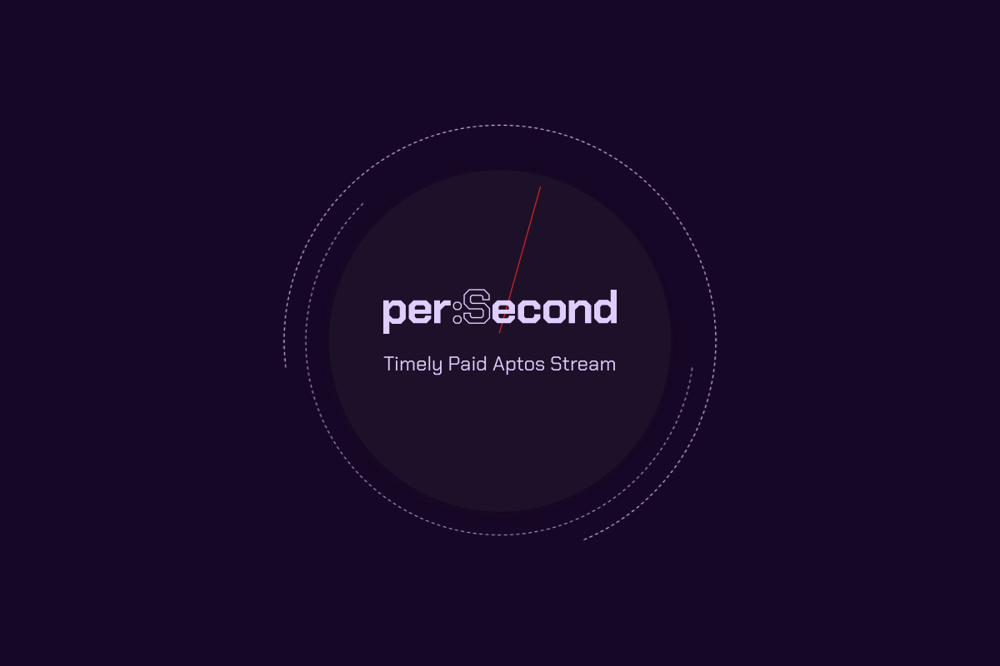

<blockquote align="center">
<br/>
<br/>
<a href="https://persecond.live" target="_blank">
👀 persecond.live
</a>
<p>Demo</p>
<br/>
<a href="https://github.com/ggomaeng/persecond/tree/master/move_module" target="_blank">
📜 Move Modules
</a>
<p>Modules</p>
<br/>
<br/>
</blockquote>

- [perSecond 👋🏻](#persecond-)
	- [Our goal roadmap for Aptos Hackathon 📝](#our-goal-roadmap-for-aptos-hackathon-)
	- [Contracts 📜](#contracts-)
	- [What we could've done better 🤔](#what-we-couldve-done-better-)
	- [Web Development Stack Used](#web-development-stack-used)
	- [Development Environment](#development-environment)



# perSecond 👋🏻

> Generate a meeting link and share it with the intended expert, setting the time-based payment stream via Aptos Blockchain.

## Our goal roadmap for Aptos Hackathon 📝

- [x] Start our ideation & product building from scratch at the hackathon for ultimate challenge and fun 🥳
- [x] Store session information on Aptos Blockchain
- [x] Support Multiple wallets within our dApp
- [x] Experimental UI/UX
- [x] Video call using WebRTC
- [x] Meeting Launch Page
- [x] Video Call Page
  - [x] Dynamic link generation
- [x] Join Call Page
- [x] Tx Receipt Page
  - [x] Chat functionality
  - [ ] To be implemented: Screen Sharing
  - [ ] To be implemented: 1:N Video Call

## Contracts 📜

> More information about the contract can be found the [📦 Contract Github Repository](https://github.com/ggomaeng/persecond/tree/master/move_module)

---

## What we could've done better 🤔

- Unit test code for front-end is lacking.
- Whitelist functionality using merkel tree
- Dashboard page
- Scheduled call

---

## Web Development Stack Used

- React.js
- Zustand
- @aptos-labs/wallet-adapter-react
- Tailwind for CSS styling
- 👉🏻 [Move Modules](https://github.com/ggomaeng/persecond/tree/master/move_module)

---

## Development Environment

```shell
npm install
npm start
```

Open [http://localhost:3000](http://localhost:3000) with your browser to see the result.
